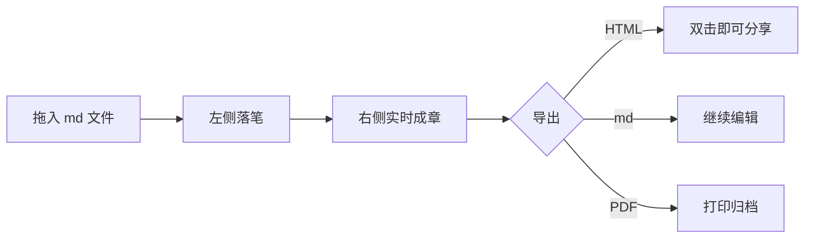

# 欢迎使用 Markdown 手札

**Markdown 手札** 是「即开宝匣」里的即开即写编辑器——拖入文件、落笔成章，数据不出本地。

## 上手要点

- **拖文件进来**：把 `.md` 文件直接拖到页面任意位置即可打开
- **刷新不丢稿**：内容自动保存在本浏览器，回来接着写
- **三种导出**：独立 HTML / Markdown 源文件 / PDF，导出前先选格式
- **快捷键**：`Ctrl/Cmd+O` 打开 · `Ctrl/Cmd+S` 保存 · `Ctrl/Cmd+E` 导出
- **三种视图**：分栏对照、纯编辑、沉浸阅读，随手切换

## 它能渲染什么

- [x] 任务列表：井然有序
- **表格**、_强调_、~~删除线~~、`行内代码` 与 [链接](https://example.com)
- 数学公式：$E=mc^2$ 行内公式，以及块级公式

$$
\int_{0}^{\infty} e^{-x^2}\,dx = \frac{\sqrt{\pi}}{2}
$$

### Mermaid 图示



### 代码高亮

```ts
const greet = (name: string): string => `你好，${name}！`;
console.log(greet('手札'));
```

### 表格

|   特性   | 手札 | 说明            |
| :------: | :--: | --------------- |
| 实时预览 |  ✅  | 防抖 200ms      |
| 图示公式 |  ✅  | Mermaid + KaTeX |
| 本地留存 |  ✅  | 刷新不丢稿      |

> 写完点工具栏「导出」，选一种格式带走。这份示例可直接改成你的手稿。
